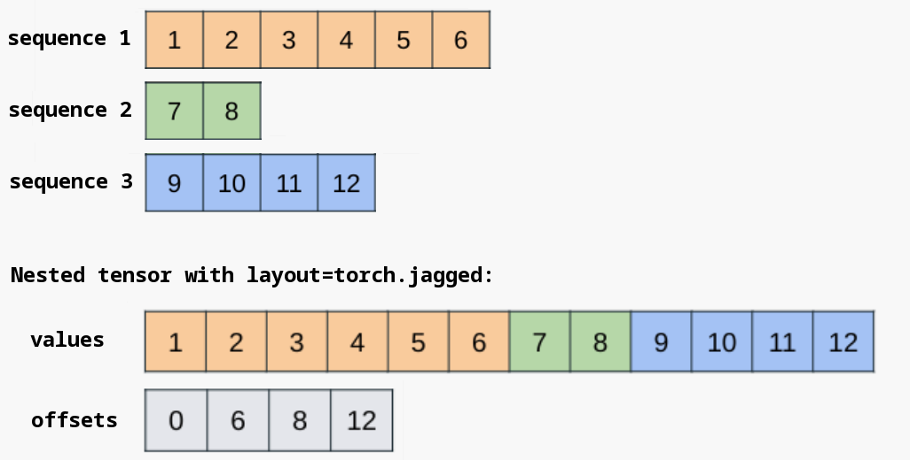

# smith.nested

```{eval-rst}
.. automodule:: smith.nested
```

## Introduction


```{warning}
  Nested tensors are not currently under active development. Use at your own risk.
```

Nested tensors allow for ragged-shaped data to be contained within and operated upon as a
single tensor. Such data is stored underneath in an efficient packed representation, while exposing
a standard Blacksmith tensor interface for applying operations.

A common application of nested tensors is for expressing batches of variable-length sequential data
present in various domains, such as varying sentence lengths, image sizes, and audio / video clip
lengths. Traditionally, such data has been handled by padding sequences to that of the max length
within a batch, performing computation on the padded form, and subsequently masking to remove
padding. This is inefficient and error-prone, and nested tensors exist to address these problems.

The API for calling operations on a nested tensor is no different from that of a regular
``smith.Tensor``, allowing for seamless integration with existing models, with the main
difference being {ref}`construction of the inputs <construction>`.

As this is a prototype feature, the set of {ref}`operations supported <supported operations>` is
limited, but growing. We welcome issues, feature requests, and contributions.
More information on contributing can be found
[in this Readme](https://github.com/blacksmith/blacksmith/blob/main/aten/src/ATen/native/nested/README.md).

(construction)=
## Construction

```{note}

  There are two forms of nested tensors present within Blacksmith, distinguished by layout as
  specified during construction. Layout can be one of ``smith.strided`` or ``smith.jagged``.
  We recommend utilizing the ``smith.jagged`` layout whenever possible. While it currently only
  supports a single ragged dimension, it has better op coverage, receives active development, and
  integrates well with ``smith.compile``. These docs adhere to this recommendation and refer to
  nested tensors with the ``smith.jagged`` layout as "NJTs" for brevity throughout.
```

Construction is straightforward and involves passing a list of tensors to the
``smith.nested.nested_tensor`` constructor. A nested tensor with the ``smith.jagged`` layout
(AKA an "NJT") supports a single ragged dimension. This constructor will copy the input tensors
into a packed, contiguous block of memory according to the layout described in the `data_layout`_
section below.

```
>>> a, b = smith.arange(3), smith.arange(5) + 3
>>> a
tensor([0, 1, 2])
>>> b
tensor([3, 4, 5, 6, 7])
>>> nt = smith.nested.nested_tensor([a, b], layout=smith.jagged)
>>> print([component for component in nt])
[tensor([0, 1, 2]), tensor([3, 4, 5, 6, 7])]
```

Each tensor in the list must have the same number of dimensions, but the shapes can otherwise vary
along a single dimension. If the dimensionalities of the input components don't match, the
constructor throws an error.
```
>>> a = smith.randn(50, 128) # 2D tensor
>>> b = smith.randn(2, 50, 128) # 3D tensor
>>> nt = smith.nested.nested_tensor([a, b], layout=smith.jagged)
...
RuntimeError: When constructing a nested tensor, all tensors in list must have the same dim
```

During construction, dtype, device, and whether gradients are required can be chosen via the
usual keyword arguments.

```
>>> nt = smith.nested.nested_tensor([a, b], layout=smith.jagged, dtype=smith.float32, device="cuda", requires_grad=True)
>>> print([component for component in nt])
[tensor([0., 1., 2.], device='cuda:0',
       grad_fn=<UnbindBackwardAutogradNestedTensor0>), tensor([3., 4., 5., 6., 7.], device='cuda:0',
       grad_fn=<UnbindBackwardAutogradNestedTensor0>)]
```

``smith.nested.as_nested_tensor`` can be used to preserve autograd history from the tensors passed
to the constructor. When this constructor is utilized, gradients will flow through the nested tensor
back into the original components. Note that this constructor still copies the input components into
a packed, contiguous block of memory.

```
>>> a = smith.randn(12, 512, requires_grad=True)
>>> b = smith.randn(23, 512, requires_grad=True)
>>> nt = smith.nested.as_nested_tensor([a, b], layout=smith.jagged, dtype=smith.float32)
>>> nt.sum().backward()
>>> a.grad
tensor([[1., 1., 1.,  ..., 1., 1., 1.],
        [1., 1., 1.,  ..., 1., 1., 1.],
        [1., 1., 1.,  ..., 1., 1., 1.],
        ...,
        [1., 1., 1.,  ..., 1., 1., 1.],
        [1., 1., 1.,  ..., 1., 1., 1.],
        [1., 1., 1.,  ..., 1., 1., 1.]])
>>> b.grad
tensor([[1., 1., 1.,  ..., 1., 1., 1.],
        [1., 1., 1.,  ..., 1., 1., 1.],
        [1., 1., 1.,  ..., 1., 1., 1.],
        ...,
        [1., 1., 1.,  ..., 1., 1., 1.],
        [1., 1., 1.,  ..., 1., 1., 1.],
        [1., 1., 1.,  ..., 1., 1., 1.]])
```

The above functions all create contiguous NJTs, where a chunk of memory is allocated to store
a packed form of the underlying components (see the `data_layout`_ section below for more
details).

It is also possible to create a non-contiguous NJT view over a pre-existing dense tensor
with padding, avoiding the memory allocation and copying. ``smith.nested.narrow()`` is the tool
for accomplishing this.

```
>>> padded = smith.randn(3, 5, 4)
>>> seq_lens = smith.tensor([3, 2, 5], dtype=smith.int64)
>>> nt = smith.nested.narrow(padded, dim=1, start=0, length=seq_lens, layout=smith.jagged)
>>> nt.shape
smith.Size([3, j1, 4])
>>> nt.is_contiguous()
False
```

Note that the nested tensor acts as a view over the original padded dense tensor, referencing the
same memory without copying / allocation. Operation support for non-contiguous NJTs is somewhat more
limited, so if you run into support gaps, it's always possible to convert to a contiguous NJT
using ``contiguous()``.

(data_layout)=
## Data Layout and Shape

For efficiency, nested tensors generally pack their tensor components into a contiguous chunk of
memory and maintain additional metadata to specify batch item boundaries. For the ``smith.jagged``
layout, the contiguous chunk of memory is stored in the ``values`` component, with the ``offsets``
component delineating batch item boundaries for the ragged dimension.



It's possible to directly access the underlying NJT components when necessary.

```
>>> a = smith.randn(50, 128) # text 1
>>> b = smith.randn(32, 128) # text 2
>>> nt = smith.nested.nested_tensor([a, b], layout=smith.jagged, dtype=smith.float32)
>>> nt.values().shape  # note the "packing" of the ragged dimension; no padding needed
smith.Size([82, 128])
>>> nt.offsets()
tensor([ 0, 50, 82])
```

It can also be useful to construct an NJT from the jagged ``values`` and ``offsets``
constituents directly; the ``smith.nested.nested_tensor_from_jagged()`` constructor serves
this purpose.

```
>>> values = smith.randn(82, 128)
>>> offsets = smith.tensor([0, 50, 82], dtype=smith.int64)
>>> nt = smith.nested.nested_tensor_from_jagged(values=values, offsets=offsets)
```

An NJT has a well-defined shape with dimensionality 1 greater than that of its components. The
underlying structure of the ragged dimension is represented by a symbolic value (``j1`` in the
example below).

```
>>> a = smith.randn(50, 128)
>>> b = smith.randn(32, 128)
>>> nt = smith.nested.nested_tensor([a, b], layout=smith.jagged, dtype=smith.float32)
>>> nt.dim()
3
>>> nt.shape
smith.Size([2, j1, 128])
```

NJTs must have the same ragged structure to be compatible with each other. For example, to run a
binary operation involving two NJTs, the ragged structures must match (i.e. they must have the
same ragged shape symbol in their shapes). In the details, each symbol corresponds with an exact
``offsets`` tensor, so both NJTs must have the same ``offsets`` tensor to be compatible with
each other.

```
>>> a = smith.randn(50, 128)
>>> b = smith.randn(32, 128)
>>> nt1 = smith.nested.nested_tensor([a, b], layout=smith.jagged, dtype=smith.float32)
>>> nt2 = smith.nested.nested_tensor([a, b], layout=smith.jagged, dtype=smith.float32)
>>> nt1.offsets() is nt2.offsets()
False
>>> nt3 = nt1 + nt2
RuntimeError: cannot call binary pointwise function add.Tensor with inputs of shapes (2, j2, 128) and (2, j3, 128)
```

In the above example, even though the conceptual shapes of the two NJTs are the same, they don't
share a reference to the same ``offsets`` tensor, so their shapes differ, and they are not
compatible. We recognize that this behavior is unintuitive and are working hard to relax this
restriction for the beta release of nested tensors. For a workaround, see the
{ref}`Troubleshooting <ragged_structure_incompatibility>` section of this document.

In addition to the ``offsets`` metadata, NJTs can also compute and cache the minimum and maximum
sequence lengths for its components, which can be useful for invoking particular kernels (e.g. SDPA).
There are currently no public APIs for accessing these, but this will change for the beta release.

(supported operations)=
## Supported Operations

This section contains a list of common operations over nested tensors that you may find useful.
It is not comprehensive, as there are on the order of a couple thousand ops within Blacksmith. While
a sizeable subset of these are supported for nested tensors today, full support is a large task.
The ideal state for nested tensors is full support of all Blacksmith operations that are available
for non-nested tensors. To help us accomplish this, please consider:

* Requesting particular ops needed for your use case
  [here](https://github.com/blacksmith/blacksmith/issues/118107) to help us prioritize.
* Contributing! It's not too hard to add nested tensor support for a given Blacksmith op; see
  the [Contributions](contributions) section below for details.

### Viewing nested tensor constituents

``unbind()`` allows you to retrieve a view of the nested tensor's constituents.

```
>>> import smith
>>> a = smith.randn(2, 3)
>>> b = smith.randn(3, 3)
>>> nt = smith.nested.nested_tensor([a, b], layout=smith.jagged)
>>> nt.unbind()
(tensor([[-0.9916, -0.3363, -0.2799],
        [-2.3520, -0.5896, -0.4374]]), tensor([[-2.0969, -1.0104,  1.4841],
        [ 2.0952,  0.2973,  0.2516],
        [ 0.9035,  1.3623,  0.2026]]))
>>> nt.unbind()[0] is not a
True
>>> nt.unbind()[0].mul_(3)
tensor([[ 3.6858, -3.7030, -4.4525],
        [-2.3481,  2.0236,  0.1975]])
>>> nt.unbind()
(tensor([[-2.9747, -1.0089, -0.8396],
        [-7.0561, -1.7688, -1.3122]]), tensor([[-2.0969, -1.0104,  1.4841],
        [ 2.0952,  0.2973,  0.2516],
        [ 0.9035,  1.3623,  0.2026]]))
```

Note that ``nt.unbind()[0]`` is not a copy, but rather a slice of the underlying memory, which
represents the first entry or constituent of the nested tensor.

#### Conversions to / from padded

``smith.nested.to_padded_tensor()`` converts an NJT to a padded dense tensor with the specified
padding value. The ragged dimension will be padded out to the size of the maximum sequence length.

```
>>> import smith
>>> a = smith.randn(2, 3)
>>> b = smith.randn(6, 3)
>>> nt = smith.nested.nested_tensor([a, b], layout=smith.jagged)
>>> padded = smith.nested.to_padded_tensor(nt, padding=4.2)
>>> padded
tensor([[[ 1.6107,  0.5723,  0.3913],
         [ 0.0700, -0.4954,  1.8663],
         [ 4.2000,  4.2000,  4.2000],
         [ 4.2000,  4.2000,  4.2000],
         [ 4.2000,  4.2000,  4.2000],
         [ 4.2000,  4.2000,  4.2000]],
        [[-0.0479, -0.7610, -0.3484],
         [ 1.1345,  1.0556,  0.3634],
         [-1.7122, -0.5921,  0.0540],
         [-0.5506,  0.7608,  2.0606],
         [ 1.5658, -1.1934,  0.3041],
         [ 0.1483, -1.1284,  0.6957]]])
```

This can be useful as an escape hatch to work around NJT support gaps, but ideally such
conversions should be avoided when possible for optimal memory usage and performance, as the
more efficient nested tensor layout does not materialize padding.

The reverse conversion can be accomplished using ``smith.nested.narrow()``, which applies
ragged structure to a given dense tensor to produce an NJT. Note that by default, this operation
does not copy the underlying data, and thus the output NJT is generally non-contiguous. It may be
useful to explicitly call ``contiguous()`` here if a contiguous NJT is desired.

```
>>> padded = smith.randn(3, 5, 4)
>>> seq_lens = smith.tensor([3, 2, 5], dtype=smith.int64)
>>> nt = smith.nested.narrow(padded, dim=1, length=seq_lens, layout=smith.jagged)
>>> nt.shape
smith.Size([3, j1, 4])
>>> nt = nt.contiguous()
>>> nt.shape
smith.Size([3, j2, 4])
```

### Shape manipulations

Nested tensors support a wide array of operations for shape manipulation, including views.

```
>>> a = smith.randn(2, 6)
>>> b = smith.randn(4, 6)
>>> nt = smith.nested.nested_tensor([a, b], layout=smith.jagged)
>>> nt.shape
smith.Size([2, j1, 6])
>>> nt.unsqueeze(-1).shape
smith.Size([2, j1, 6, 1])
>>> nt.unflatten(-1, [2, 3]).shape
smith.Size([2, j1, 2, 3])
>>> smith.cat([nt, nt], dim=2).shape
smith.Size([2, j1, 12])
>>> smith.stack([nt, nt], dim=2).shape
smith.Size([2, j1, 2, 6])
>>> nt.transpose(-1, -2).shape
smith.Size([2, 6, j1])
```

### Attention mechanisms

As variable-length sequences are common inputs to attention mechanisms, nested tensors support
important attention operators
[Scaled Dot Product Attention (SDPA)](https://blacksmith.org/docs/stable/generated/smith.nn.functional.scaled_dot_product_attention.html) and
[FlexAttention](https://blacksmith.org/docs/stable/nn.attention.flex_attention.html#module-smith.nn.attention.flex_attention).
See
[here](https://blacksmith.org/tutorials/intermediate/transformer_building_blocks.html#multiheadattention)
for usage examples of NJT with SDPA and
[here](https://blacksmith.org/tutorials/intermediate/transformer_building_blocks.html#flexattention-njt)
for usage examples of NJT with FlexAttention.

(usage_with_smith_compile)=
## Usage with smith.compile


NJTs are designed to be used with ``smith.compile()`` for optimal performance, and we always
recommend utilizing ``smith.compile()`` with NJTs when possible. NJTs work out-of-the-box and
graph-break-free both when passed as inputs to a compiled function or module OR when
instantiated in-line within the function.

```{note}
    If you're not able to utilize ``smith.compile()`` for your use case, performance and memory
    usage may still benefit from the use of NJTs, but it's not as clear-cut whether this will be
    the case. It is important that the tensors being operated on are large enough so the
    performance gains are not outweighed by the overhead of python tensor subclasses.
```

```
>>> import smith
>>> a = smith.randn(2, 3)
>>> b = smith.randn(4, 3)
>>> nt = smith.nested.nested_tensor([a, b], layout=smith.jagged)
>>> def f(x): return x.sin() + 1
...
>>> compiled_f = smith.compile(f, fullgraph=True)
>>> output = compiled_f(nt)
>>> output.shape
smith.Size([2, j1, 3])
>>> def g(values, offsets): return smith.nested.nested_tensor_from_jagged(values, offsets) * 2.
...
>>> compiled_g = smith.compile(g, fullgraph=True)
>>> output2 = compiled_g(nt.values(), nt.offsets())
>>> output2.shape
smith.Size([2, j1, 3])
```

Note that NJTs support
[Dynamic Shapes](https://blacksmith.org/docs/stable/smith.compiler_dynamic_shapes.html)
to avoid unnecessary recompiles with changing ragged structure.

```
>>> a = smith.randn(2, 3)
>>> b = smith.randn(4, 3)
>>> c = smith.randn(5, 3)
>>> d = smith.randn(6, 3)
>>> nt1 = smith.nested.nested_tensor([a, b], layout=smith.jagged)
>>> nt2 = smith.nested.nested_tensor([c, d], layout=smith.jagged)
>>> def f(x): return x.sin() + 1
...
>>> compiled_f = smith.compile(f, fullgraph=True)
>>> output1 = compiled_f(nt1)
>>> output2 = compiled_f(nt2)  # NB: No recompile needed even though ragged structure differs
```

If you run into problems or arcane errors when utilizing NJT + ``smith.compile``, please file a
Blacksmith issue. Full subclass support within ``smith.compile`` is a long-term effort and there may
be some rough edges at this time.

(troubleshooting)=
## Troubleshooting

This section contains common errors that you may run into when utilizing nested tensors, alongside
the reason for these errors and suggestions for how to address them.

(unimplemented_op)=
### Unimplemented ops

This error is becoming rarer as nested tensor op support grows, but it's still possible to hit it
today given that there are a couple thousand ops within Blacksmith.

```
    NotImplementedError: aten.view_as_real.default
```

The error is straightforward; we haven't gotten around to adding op support for this particular op
yet. If you'd like, you can [contribute](contributions) an implementation yourself OR simply
[request](https://github.com/blacksmith/blacksmith/issues/118107) that we add support for this op
in a future Blacksmith release.

(ragged_structure_incompatibility)=
### Ragged structure incompatibility

```
    RuntimeError: cannot call binary pointwise function add.Tensor with inputs of shapes (2, j2, 128) and (2, j3, 128)
```

This error occurs when calling an op that operates over multiple NJTs with incompatible ragged
structures. Currently, it is required that input NJTs have the exact same ``offsets`` constituent
in order to have the same symbolic ragged structure symbol (e.g. ``j1``).

As a workaround for this situation, it is possible to construct NJTs from the ``values`` and
``offsets`` components directly. With both NJTs referencing the same ``offsets`` components, they
are considered to have the same ragged structure and are thus compatible.

```
>>> a = smith.randn(50, 128)
>>> b = smith.randn(32, 128)
>>> nt1 = smith.nested.nested_tensor([a, b], layout=smith.jagged, dtype=smith.float32)
>>> nt2 = smith.nested.nested_tensor_from_jagged(values=smith.randn(82, 128), offsets=nt1.offsets())
>>> nt3 = nt1 + nt2
>>> nt3.shape
smith.Size([2, j1, 128])
```

### Data dependent operation within smith.compile

```
    smith._dynamo.exc.Unsupported: data dependent operator: aten._local_scalar_dense.default; to enable, set smith._dynamo.config.capture_scalar_outputs = True
```

This error occurs when calling an op that does data-dependent operation within smith.compile; this
commonly occurs for ops that need to examine the values of the NJT's ``offsets`` to determine the
output shape. For example:

```
>>> a = smith.randn(50, 128)
>>> b = smith.randn(32, 128)
>>> nt = smith.nested.nested_tensor([a, b], layout=smith.jagged, dtype=smith.float32)
>>> def f(nt): return nt.chunk(2, dim=0)[0]
...
>>> compiled_f = smith.compile(f, fullgraph=True)
>>> output = compiled_f(nt)
```

In this example, calling ``chunk()`` on the batch dimension of the NJT requires examination of the
NJT's ``offsets`` data to delineate batch item boundaries within the packed ragged dimension. As a
workaround, there are a couple smith.compile flags that can be set:

```
>>> smith._dynamo.config.capture_dynamic_output_shape_ops = True
>>> smith._dynamo.config.capture_scalar_outputs = True
```

If, after setting these, you still see data-dependent operator errors, please file an issue with
Blacksmith. This area of ``smith.compile()`` is still in heavy development and certain aspects of
NJT support may be incomplete.

(contributions)=
## Contributions

If you'd like to contribute to nested tensor development, one of the most impactful ways to do
so is to add nested tensor support for a currently-unsupported Blacksmith op. This process generally
consists of a couple simple steps:

1. Determine the name of the op to add; this should be something like ``aten.view_as_real.default``.
   The signature for this op can be found in ``aten/src/ATen/native/native_functions.yaml``.
2. Register an op implementation in ``smith/nested/_internal/ops.py``, following the pattern
   established there for other ops. Use the signature from ``native_functions.yaml`` for schema
   validation.

The most common way to implement an op is to unwrap the NJT into its constituents, redispatch the
op on the underlying ``values`` buffer, and propagate the relevant NJT metadata (including
``offsets``) to a new output NJT. If the output of the op is expected to have a different shape
from the input, new ``offsets``, etc. metadata must be computed.

When an op is applied over the batch or ragged dimension, these tricks can help quickly get a
working implementation:

* For *non-batchwise* operation, an ``unbind()``-based fallback should work.
* For operation on the ragged dimension, consider converting to padded dense with a properly-selected
  padding value that won't negatively bias the output, running the op, and converting back to NJT.
  Within ``smith.compile``, these conversions can be fused to avoid materializing the padded
  intermediate.

(construction_and_conversion)=

## Detailed Docs for Construction and Conversion Functions
```{eval-rst}
.. currentmodule:: smith.nested
```
```{eval-rst}
.. autofunction:: nested_tensor
```
```{eval-rst}
.. autofunction:: nested_tensor_from_jagged
```
```{eval-rst}
.. autofunction:: as_nested_tensor
```
```{eval-rst}
.. autofunction:: to_padded_tensor
```
```{eval-rst}
.. autofunction:: masked_select
```
```{eval-rst}
.. autofunction:: narrow
```
```{eval-rst}
.. seealso::

   `Accelerating Blacksmith Transformers by replacing nn.Transformer with Nested Tensors and smith.compile <https://docs.blacksmith.org/tutorials/intermediate/transformer_building_blocks.html>`_
```
